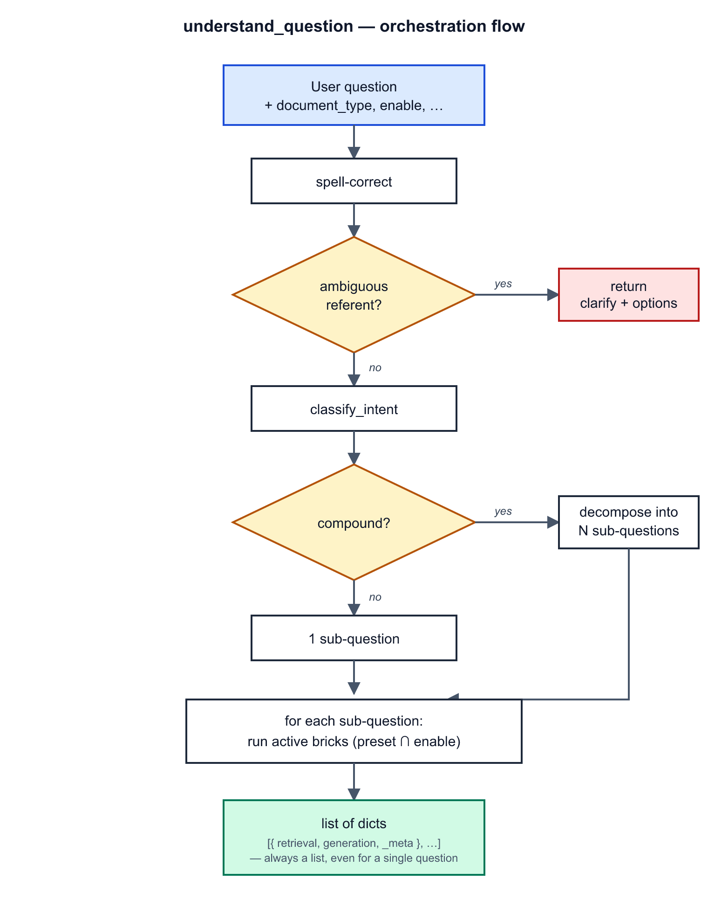
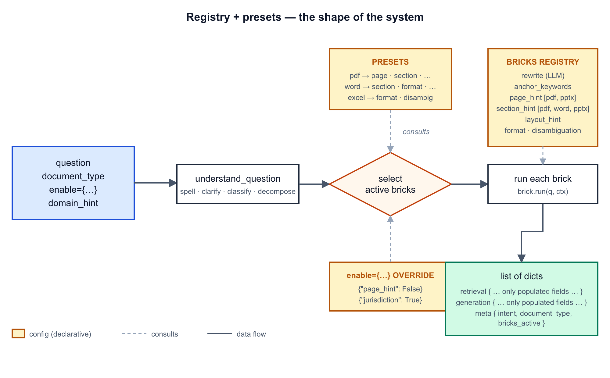
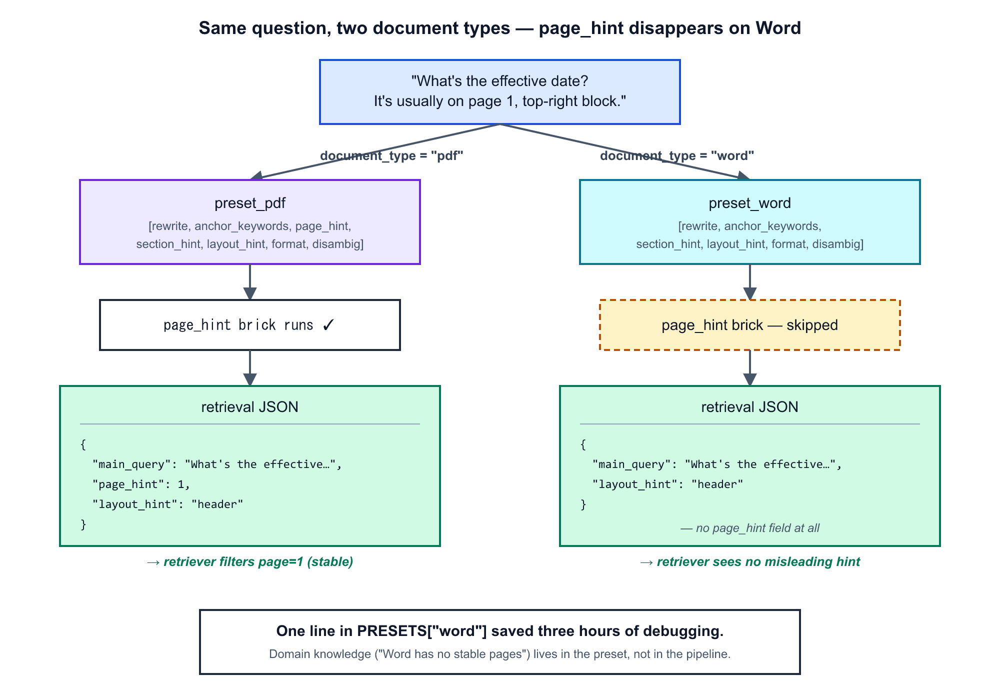

# One Question, N Bricks, Zero `null`

*The pattern that let me delete 60 lines of RAG pipeline code — and that keeps the "understand the question" layer immune to whatever document format you'll have to support next.*

---

A user types: *"the premium, page 3 of the contract."*

Your retriever filters on `page=3`. It finds nothing useful. You spend three hours debugging before you realize the document is a `.docx`, and **a `.docx` has no intrinsic pagination**. The page 3 the user saw when they typed the question has nothing to do with the page 3 you see now. The font changed. The window isn't the same width. The very concept of *page* doesn't exist in the format.

You should never have sent `page_hint=3` to the retriever in the first place. The problem is that your code didn't know it shouldn't.

Here's the pattern that fixes that — and all of its cousins.

---

## One function. Many small functions behind it.

The whole "understand the question" layer of a RAG, seen from the outside, is this:

```python
plan = understand_question(
    "What's the premium?",
    document_type="pdf",
)
# → [ { "retrieval": {...}, "generation": {...}, "_meta": {...} } ]
```

One public function. One question. A **list** of dicts (always a list — I'll come back to that).

Behind it, lots of small functions, each doing its own job: fix typos, rephrase in document vocabulary, extract a page number, spot a section, detect a requested output format, catch a *"not the X one"* hint that needs to flow to generation for disambiguation.

Each of them does **exactly one thing**. None of them knows what the others do. Together, they build the JSON that says everything the rest of the pipeline needs to know.



The pattern we'll see is how to organize them so that **adding the 11th brick doesn't break the first ten**.

---

## The hardcoded cascade, and why it cracks

First instinct, the one we all write at the start:

```python
def understand_question(question):
    corrected = correct_spelling(question)
    return {
        "retrieval": {
            "main_query":      corrected,
            "rewrites":        rewrite_query(corrected),
            "anchor_keywords": extract_anchor_keywords(corrected),
            "page_hint":       extract_hints(corrected).page_hint,
            "section_hint":    extract_hints(corrected).section_hint,
            "layout_hint":     extract_hints(corrected).layout_hint,
        },
        "generation": {
            "original_question": corrected,
            "format_constraint": extract_format_constraint(corrected),
            "disambiguation":    extract_disambiguation(corrected)[0],
        },
    }
```

It works. As long as you're doing PDFs.

Step out of PDF, and every line above turns into a trap.

**The Word trap.** `page_hint=3` ends up in the JSON even when the document has no stable pages. You send a misleading signal to the retriever, which filters on nothing and gives you zero results — or worse, wrong results.

**The Excel trap.** `section_hint` makes no sense in a workbook. No TOC, no hierarchical headings. Excel has sheets and columns — orthogonal axes to a Word document. But your hardcoded cascade will dutifully push `section_hint=null`, because it doesn't know any better.

**The bloated-JSON trap.** Out of ten bricks, three have something to say for the current question. The other seven return `null`. To the downstream consumer, `null` is ambiguous: *"the brick ran and found nothing"* or *"the brick didn't even run because it had no business being here"*?

**The size trap.** You add the 11th brick. You modify the main function. Then the 12th. Then the 20th. After a few months you have an 80-line pipeline you don't dare touch, because every addition risks breaking what already works.

> The real problem: the cascade is static, the context is dynamic.

The context — *what kind of document are we querying, what information can even exist in it* — should drive what runs. A hardcoded cascade has no handle for that.

---

## The target shape

```python
def understand_question(
    question: str,
    *,
    document_type: str = "pdf",                # "pdf" | "word" | "excel" | "email" | "pptx"
    enable: dict[str, bool] | None = None,
    domain_hint: str = "",
    conversation_history: list | None = None,
) -> list[dict]:
    ...
```

Three properties this signature must guarantee.

**1. Always a list.** A simple question = list of 1. A compound question — *"the premium AND the exclusions"* — = list of 2 independent entries. The downstream consumer never has to figure out whether to handle a dict or a list of dicts. No `if isinstance(...)`. You loop. Done.

**2. The JSON contains only fields that were actually populated.** No `null`. If the `page_hint` brick isn't active (because we're on a Word) or didn't find anything (because the question doesn't mention a page), the field **doesn't appear**. The consumer can write `if "page_hint" in plan["retrieval"]` with zero ambiguity.

**3. `document_type` drives the default; `enable` allows fine-grained override.** Most calls will only pass `document_type`. The system knows what to disable. Power users can flip individual bricks with `enable={"page_hint": False}`.

---

## The pattern: registry + presets

Two ingredients. Not one more.

### The registry

Each capability becomes a `Brick`. Not a free-floating function — a **declarative entry** in a dict:

```python
@dataclass(frozen=True)
class Brick:
    name: str
    target: str                                    # "retrieval" or "generation"
    run: Callable[[str, dict], dict | None]
    compatible_doc_types: tuple[str, ...] = ()     # () = all
    requires_llm: bool = False
    description: str = ""
```

`run` takes the question and a context. It returns either `None` (nothing to say), or a dict of fields to merge into the target.

And the registry itself:

```python
BRICKS = {
    "rewrite":         Brick("rewrite",         "retrieval",  _run_rewrite, requires_llm=True),
    "anchor_keywords": Brick("anchor_keywords", "retrieval",  _run_anchors),
    "page_hint":       Brick("page_hint",       "retrieval",  _run_page_hint,
                             compatible_doc_types=("pdf", "pptx")),
    "section_hint":    Brick("section_hint",    "retrieval",  _run_section_hint,
                             compatible_doc_types=("pdf", "word", "pptx")),
    "format":          Brick("format",          "generation", _run_format),
    "disambiguation":  Brick("disambiguation",  "generation", _run_disambig),
    # ...
}
```

> Adding the 11th brick = adding one line. Without touching the pipeline.

### The presets

Each document type has a default list of active bricks.

```python
PRESETS = {
    "pdf":   ["rewrite", "anchor_keywords", "page_hint", "section_hint", "layout_hint",
              "format", "disambiguation"],
    "word":  ["rewrite", "anchor_keywords",              "section_hint", "layout_hint",
              "format", "disambiguation"],   # ← no page_hint
    "excel": ["rewrite", "anchor_keywords", "format", "disambiguation"],
    # ...
}
```

This is where **domain knowledge** lives.

*"In Word, talking about a page makes no sense."* *"In Excel, you talk about sheets and columns, not sections."*

The user doesn't necessarily know that. The system does — and that's its job.

### The orchestration

And the pipeline? It becomes tiny. For each sub-question, for each active brick, run, drop the result into `retrieval` or `generation`.

```python
for name in active_bricks:
    brick = BRICKS[name]
    if brick.compatible_doc_types and doc_type not in brick.compatible_doc_types:
        continue
    result = brick.run(q, ctx)
    if not result:
        continue
    output[brick.target].update(result)
    output["_meta"]["bricks_active"].append(name)
```

The pipeline doesn't know **what** the bricks do. It just knows how to call them in the declared order and merge their results. All the domain knowledge lives in the registry (what each brick does) and the presets (which ones to run by default).



Three things to read on this diagram. The two yellow boxes on the left (`PRESETS`, `enable`) are **inputs** that decide *which bricks run* — they don't run anything themselves. The yellow box in the middle (`BRICKS`) is the **registry** that says *how each brick runs*. And the green box on the right is the JSON whose shape adapts to whatever ran.

Move a brick from one preset to another, and nothing else changes. Add a brick to the registry, and presets can pick it up. The arrows that matter are the dotted ones — they're consultations, not steps.

---

## The Word case, plainly

The user types: *"the premium, page 3 of the contract."* The document is a `.docx`.

With the hardcoded cascade, you know how it goes: `page_hint=3` ends up in the JSON, the retriever tries to filter, the filter hits nothing or — worse — hits the wrong page, you spend three hours debugging.

With registry + Word preset:

- `PRESETS["word"]` does not contain `page_hint`.
- The `page_hint` brick **does not run**.
- The `page_hint` field **does not appear** in the JSON.
- The downstream retriever receives **no** misleading signal.

Three hours of debugging avoided by one line in a dict.



You can even go further if your product calls for it: add a `page_hint_approximate` brick to the Word preset, producing `{"page_hint": 3, "page_hint_approximate": true}`. The downstream retriever can then use it as a soft post-filter, not a hard pre-filter. That's a **product** decision, not an architecture one — and the pattern makes it trivial to implement.

---

## The override, for unusual days

The preset is a default. Not a religion.

```python
# Skip decomposition (you know the question is simple)
plan = understand_question(q, document_type="pdf", enable={"decompose": False})

# Activate a custom brick that's not in the preset
plan = understand_question(q, document_type="pdf", enable={"jurisdiction": True})
```

Convention:

| `enable=...` | Effect |
|---|---|
| `None` | full preset for `document_type` |
| `{"X": False}` | preset minus X |
| `{"Y": True}` | preset plus Y (Y must exist in `BRICKS`) |
| `{"X": False, "Y": True}` | both at once |

---

## Multi-questions: always a list

> *"What are the premium and the exclusions?"*

Two questions glued together. A single retrieval pass will never produce a good answer — the premium and the exclusions live in different sections, demand different extractions, deserve their own generation prompt.

The function decomposes internally (the `decompose` brick, LLM-driven), produces two sub-questions, and returns two entries. Each entry is a complete, self-contained JSON.

```python
plan = understand_question(
    "What are the premium and the exclusions?",
    document_type="pdf",
)
# plan = [
#   { "retrieval": {"main_query": "What is the premium?",     ...}, "generation": {...} },
#   { "retrieval": {"main_query": "What are the exclusions?", ...}, "generation": {...} },
# ]
```

Simple question → list of 1. Compound question → several. The consumer loops. Done.

---

## Agentic? No thanks.

Classic temptation: have an LLM pick the bricks. *"O great model, given this question, which bricks should I activate?"*

Bad idea. Three reasons.

**Latency.** A gating LLM call is 500 ms to 1 second on every question, just to decide what to run. You pay that **before** any brick has even started working. For a system that needs to answer in two seconds, that's half the budget.

**Non-determinism.** Same user, same question, two runs: possibly two different sets of active bricks. When you debug *"why did this question work yesterday but not today?"* — good luck.

**Marginal return.** Static doc-type-driven presets capture ~95% of the right decision. Going agentic optimizes the remaining 5% at the cost of predictability, latency, and your LLM bill.

The LLM stays useful **inside** the bricks that genuinely need it (`rewrite`, `decompose`, `spell`). Not as a global orchestrator. If a use case really needs intelligent gating, add an `auto_select` opt-in brick that does it — but keep it off by default.

> Rule of thumb: **the LLM is a tool, not a conductor.**

---

## Adding a brick, in four steps

You want to extract jurisdiction (*"under French law…"*).

**1. Write the extractor.**

```python
# src/question/jurisdiction.py
def extract_jurisdiction(q: str) -> str | None:
    ...
```

**2. Declare the brick in the registry.**

```python
def _run_jurisdiction(q, _ctx):
    v = extract_jurisdiction(q)
    return {"jurisdiction": v} if v else None

BRICKS["jurisdiction"] = Brick(
    "jurisdiction", "retrieval", _run_jurisdiction,
    compatible_doc_types=("pdf", "word"),
)
```

**3. Add it to the relevant presets.**

```python
PRESETS["pdf"].append("jurisdiction")
PRESETS["word"].append("jurisdiction")
```

**4. Test it.** One case where it fires, one where it doesn't, one on an unsupported document type.

No other part of the pipeline is touched. The full-pipeline test doesn't change — it just checks that *"if the brick is listed, its output appears."*

---

## What we got out of it

One public function: `understand_question`. A list of dicts on output, **always**, even for a simple question. The JSON contains only fields actually populated — no `null`, no ambiguity.

Bricks are entries in a registry, activated by preset (default driven by `document_type`) or by fine-grained override (`enable={...}`). Document context drives the default. Domain knowledge ("page doesn't exist in Word") lives in the presets, not in the pipeline. Agentic stays inside the bricks that need it, never around them as gating.

The benefit isn't in any one brick. It's in the fact that **adding, removing, or conditioning a brick doesn't touch the pipeline**.

A pipeline you don't touch is a pipeline you don't break. A pipeline you don't break is one that can grow without becoming a debt.

If you find yourself modifying your `understand_question` function every time you add a capability, you don't have the pattern yet. And it'll cost you — not right away, but the day you want to support Excel and realize that `section_hint` means nothing in a workbook.

> Good architecture isn't the one that looks pretty on paper. It's the one you don't have to rewrite when you add the 11th brick.

Better the pattern up front than the debt at the end.
